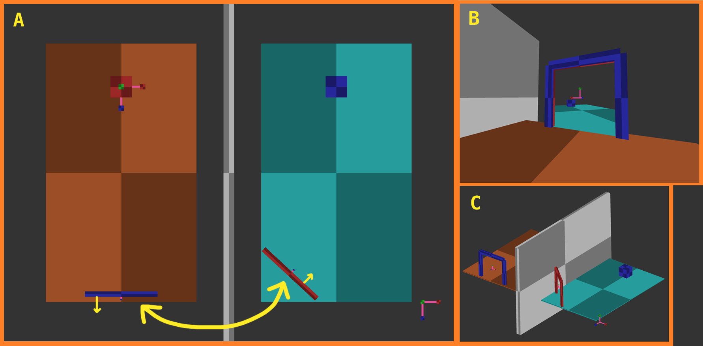
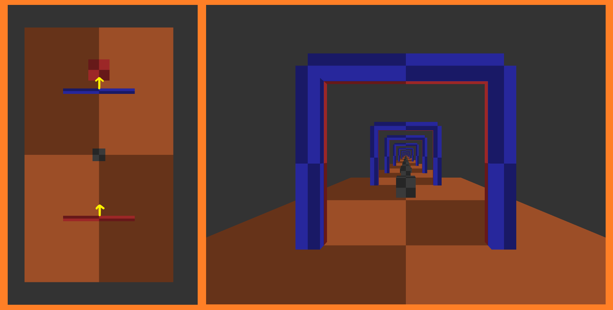

# Graphics engine with portals to simulate non-euclidean 3D scenes

> **`ES`**: [Aquí](./README%20-%20ES.md) se puede encontrar la versión en español.

* **Diego Mateos Arlanzón** *dimateos@ucm.es*
* DEGREE IN VIDEOGAME DEVELOPMENT
	* FACULTAD DE INFORMÁTICA /  UNIVERSIDAD COMPLUTENSE DE MADRID
* Degree Final Dissertation in Videogames Development
	* Academic year 2019-2020 (*september*)
	* Director: *Ana Gil Luezas*

### Index
- [Graphics engine with portals to simulate non-euclidean 3D scenes](#graphics-engine-with-portals-to-simulate-non-euclidean-3d-scenes)
		- [Index](#index)
	- [Documentation](#documentation)
	- [Issues](#issues)
	- [Release](#release)
	- [Build Dependencies](#build-dependencies)

## Documentation

Under the [`/docs`](./Docs) folder you can find the following documentation:

* [**SUMMARY**](./Docs/summary%20-%20EN.md) of the dissertation (*Abstract, Introduction and Conclusions*).
* The whole written **dissertation** (*at the moment, only in Spanish*).
* The complete [bibliography](./Docs/bibliography.md) of the dissertation.
* The app [key mappings](./Docs/keyMapping%20-%20EN.md) to do testing and real-time configurations.

## Issues

Please consider openning an [`issue`](https://github.com/dimateos/TFG_Portals/issues):
* If you have any suggestion.
* If you find any kind of error (software bug or *typo*).

> You may [*mail*](dimateos@ucm.es) me for any inquiries too

## Release

You can find the last version of the application under the  [releases](https://github.com/dimateos/TFG_Portals/releases) tab (along with further information).

## Build Dependencies

This project was developed in a [**`Visual Studio (2017)`**](https://visualstudio.microsoft.com/es/) solution, which is inside the [`VisualStudio`](./VisualStudio) folder.

> The [readme](./VisualStudio/README.md) file explains its folder structure and installation of dependencies

* [SDL 2.0](https://wiki.libsdl.org/FrontPage). Simple DirectMedia Layer.
* [glad](https://github.com/Dav1dde/glad). GL/GLES/EGL/GLX/WGL Loader-Generator based on the official specs.
* [GLM](https://glm.g-truc.net/0.9.9/index.html). OpenGL Mathematics (GLM). A C++ mathematics library for graphics programming.
* [stb_image](https://github.com/nothings/stb). Image loading/decoding from file/memory: JPG, PNG, TGA, BMP, PSD, GIF, HDR, PIC.
