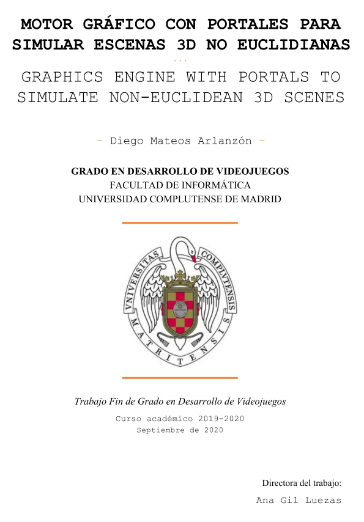

## - Abstract -
This project focuses on the simulation of 3D scenes in which portals may exist. A portal is a physical phenomenon that affects the space of the scene, in such a way that the properties necessary to continue to be considered Euclidean are no longer fulfilled. Portals manifest in pairs and essentially connect two separate surfaces from said space; this consequently allows you to see and move through them, regardless of distance.

The main objective of this project is to generate a complete, rigorous and self-contained public resource about the inner workings and implementation of these portals in a simple graphic engine. In order to develop the project, it has been necessary to carry out extensive research on existing implementation cases (mainly on the Portal videogame saga), and the technologies available to develop my own version.

In this dissertation, everything necessary to understand the phenomenon of the portals is explained in an accessible and didactic way. Even the fundamentals of computer graphics and specifically OpenGL are introduced, so that a person outside the subject, if they wish, can also follow the technical part of the explanation. Regarding my own implementation, it is fully detailed, but the specific exposition about the portals remains sufficiently abstract to be easily reproducible in the architecture of any other engine.

## Keywords

Graphics engine, Portals, Rendering, 3D Scene, Computer graphics, OpenGL, Shader.
